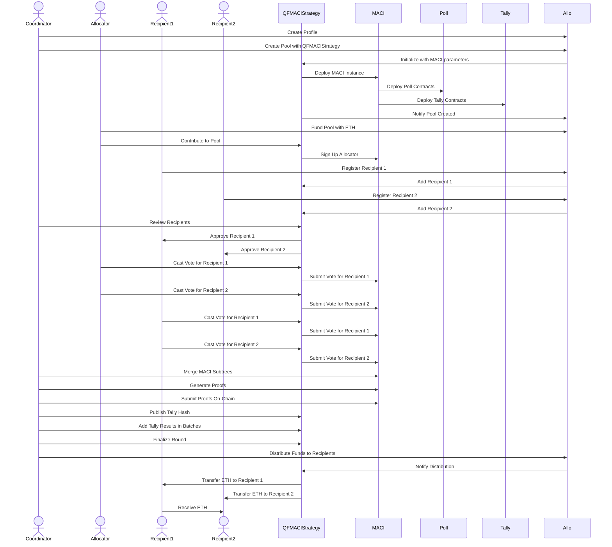

# Allo x MACI QF

A QF implementation using MACI v1.2.0 integrated into the Allo protocol.

> WIP - this is a Work in Progress project. Not yet Audited.

## Credits

### This project takes inspiration from:

- clr.fund code (https://github.com/clrfund/monorepo)
- [ctrlc03](https://github.com/ctrlc03) minimalQF code (https://github.com/ctrlc03/minimalQF)

## README for QFMACI Strategy

### Overview

The QFMACI (Quadratic Funding MACI) strategy is a component of a larger decentralized application designed to facilitate quadratic funding rounds. Quadratic funding is a democratic allocation mechanism where the amount of funds a project receives is proportional to the square of the sum of the square roots of the contributions it receives. This strategy leverages MACI (Minimal Anti-Collusion Infrastructure) to ensure vote privacy and resistance to bribery.

### Key Components

1. **QFMACIBase**: Defines the core logic for the QFMACI strategy, including recipient management, vote tallying, and fund distribution.
2. **QFMACI**: Extends QFMACIBase and integrates with MACI contracts for secure and private voting.
3. **ClonableMACIFactory**: Factory contract to deploy new MACI instances.
4. **ClonableMACI**: MACI contract for managing voting sessions.
5. **Constants and Interfaces**: Shared constants and interface definitions used across the contracts.

### Contracts

#### QFMACIBase

- **Structs**
  - `ApplicationStatus`: Represents the status of an application.
  - `InitializeParams`: Parameters for initializing the strategy.
  - `Recipient`: Details of a recipient.

- **Storage Variables**
  - `totalRecipientVotes`: Total number of votes cast for all recipients.
  - `reviewThreshold`: Number of votes required to review a recipient.
  - `registrationStartTime`, `registrationEndTime`, `allocationStartTime`, `allocationEndTime`: Timestamps for different phases.
  - `useRegistryAnchor`, `metadataRequired`: Flags for registry and metadata requirements.
  - `statusesBitMap`: Bitmap for storing recipient statuses.
  - `recipientToStatusIndexes`, `recipientIndexToAddress`: Mappings for recipient management.
  - `distributedBitMap`: Bitmap for tracking fund distributions.
  - `voiceCreditFactor`, `totalVotesSquares`, `matchingPoolSize`, `totalContributed`, `totalSpent`: Financial variables.
  - `isFinalized`, `isCancelled`: Flags for round status.
  - `alpha`, `coordinator`, `verifier`, `tallyHash`, `_maci`: Various addresses and parameters.

- **Modifiers**
  - `onlyCoordinator`: Ensures only the coordinator can call certain functions.
  - `onlyActiveRegistration`: Ensures registration is active.
  - `onlyAfterAllocation`: Ensures allocation phase has ended.
  - `onlyBeforeAllocationEnds`: Ensures allocation phase is ongoing.

- **Functions**
  - `__QFMACIBaseStrategy_init`: Internal initialization function.
  - `reviewRecipients`: Sets recipient statuses.
  - `withdraw`: Allows the pool manager to withdraw tokens if the pool is cancelled.
  - `registerRecipient`: Registers a recipient to the pool.
  - `cancel`: Cancels the funding round.
  - `finalize`: Finalizes the round after tallying votes.
  - `distributeFunds`: Distributes funds to recipients based on votes.

#### QFMACI

- **Structs**
  - `MaciParams`: Parameters for initializing MACI.
  - `InitializeParamsMACI`: Combined parameters for initializing the strategy and MACI.
  - `claimFunds`: Data structure for claiming funds.

- **Functions**
  - `initialize`: Initializes the strategy.
  - `register`: Registers a user for voting.
  - `publishTallyHash`: Publishes the IPFS hash of the vote tally.
  - `addTallyResultsBatch`: Adds and verifies tally results in batches.
  - `finalize`: Finalizes the round and calculates the quadratic alpha value.
  - `resetTally`: Resets the tally results in case of errors.
  - `withdrawContributions`: Withdraws contributed funds if the round is cancelled.
  - `withdrawContribution`: Withdraws the caller's contribution.
  - `getWhitelistedEvents`: Returns the whitelisted event IDs.
  - `allocate`: Allocates votes to a recipient.
  - `verifyClaim`: Verifies the claim of allocated tokens.
  - `validateProofOfAttendance`: Validates the proof of attendance for Zupass-specific events.

### Deployment and Testing

1. **Download ZKeys**:
  ```sh
  chmod +x download_artifacts.sh
  ./download_artifacts.sh
  ```
2. **Install Dependencies**:
  ```sh
  yarn install
  ```
3. **Start Local Node**:

   ```sh
   npx hardhat node
   ```
   **Copy 4 private keys and paste them into .env.example**

   ```sh
   Rename .env.example to .env
   ```

4. **End2End Deployment & Tests**:

   **Open a new terminal**
   ```sh
   yarn test:live
   ```

### Testing Script

The provided script tests the end-to-end functionality of the QFMACI strategy. It includes:

- Setting up test accounts and contracts.
- Funding the pool and making contributions.
- Registering recipients and reviewing them.
- Voting and tallying votes.
- Publishing the tally hash and finalizing the round.
- Distributing funds to recipients.

### Diagram

Below is the sequence diagram for the QFMACI Strategy flow:



### Description

1. **Initialization and Deployment**:
    - The coordinator creates a profile and a pool with the QFMACIStrategy.
    - The QFMACIStrategy initializes with MACI parameters and deploys the MACI instance, poll, and tally contracts.

2. **Contribution Phase**:
    - Allocators fund the pool and contribute to the pool via QFMACIStrategy.
    - The QFMACIStrategy signs up the allocator in the MACI.

3. **Registration Phase

**:
    - Recipients register themselves through Allo.
    - The QFMACIStrategy adds the recipients to the pool.

4. **Review Phase**:
    - The coordinator reviews and approves the recipients.

5. **Voting Phase**:
    - Allocators and recipients cast their votes via the QFMACIStrategy.
    - The QFMACIStrategy submits the votes to the MACI.

6. **Tally Phase**:
    - The coordinator merges MACI subtrees, generates proofs, and submits them on-chain.
    - The coordinator publishes the tally hash and adds tally results in batches.

7. **Finalization Phase**:
    - The coordinator finalizes the round.

8. **Distribution Phase**:
    - The coordinator initiates fund distribution to recipients via Allo.
    - The QFMACIStrategy transfers ETH to the recipients.

### Interactive Diagram Elements

1. **Initialize QFMACI Strategy**: Initializes the strategy with parameters.
2. **Register Recipients**: Registers recipients who will receive contributions.
3. **Contribute to Pool**: Contributors allocate funds to the pool.
4. **Vote Using MACI**: Contributors cast their votes securely using MACI.
5. **Tally Votes**: Votes are tallied using the MACI infrastructure.
6. **Publish Tally Hash**: The tally hash is published to IPFS.
7. **Finalize Round**: Finalizes the round after verifying all tallies.
8. **Distribute Funds**: Distributes funds to the recipients based on the vote tally.

### Buttons and Interactive Elements

- **Initialize**: Start the QFMACI strategy.
- **Register**: Register as a recipient.
- **Contribute**: Allocate funds to the pool.
- **Vote**: Cast votes for recipients.
- **Tally**: Tally the votes cast.
- **Publish**: Publish the tally hash.
- **Finalize**: Finalize the funding round.
- **Distribute**: Distribute funds to recipients.

### License

This project is licensed under the AGPL-3.0-only License.

### Improvements and Further Reading

For more detailed information about quadratic funding and MACI, refer to the following resources:

- [Quadratic Funding](https://wtfisqf.com/)
- [MACI (Minimal Anti-Collusion Infrastructure)](https://github.com/appliedzkp/maci)

This README provides an overview of the QFMACI strategy, its components, deployment instructions, and a detailed diagram to help users understand the workflow. The interactive elements in the diagram and buttons make it easier to navigate through the different stages of the strategy.