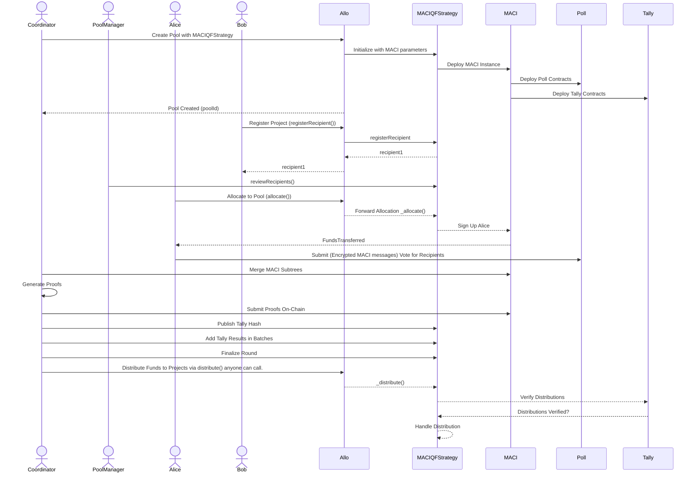

# MACIQF Strategy on Allo

A QF implementation using MACI v1.2.3 integrated into the Allo protocol.

## Credits

### This project takes inspiration from:

- [Allo-v2](https://github.com/allo-protocol/allo-v2/)
- clr.fund code (https://github.com/clrfund/monorepo)
- [ctrlc03](https://github.com/ctrlc03) minimalQF code (https://github.com/ctrlc03/minimalQF)

### Overview

The MACIQF (Quadratic Funding MACI) strategy is a component of a larger decentralized application designed to facilitate quadratic funding rounds. Quadratic funding is a democratic allocation mechanism where the amount of funds a project receives is proportional to the square of the sum of the square roots of the contributions it receives. This strategy leverages MACI (Minimal Anti-Collusion Infrastructure) to ensure vote privacy and resistance to bribery.

### Key Components

1. **MACIQFBase**: Defines the core logic for the MACIQF strategy, including recipient management, and the core Allo Interfaces.
2. **MACIQF**: Extends MACIQFBase and integrates with MACI contracts for secure and private voting.
3. **ClonableMACIFactory**: Factory contract to deploy new MACI - MACIPoll - MACITally - MACIMessageProcessor instances.
4. **ClonableMACI**: MACI contract for managing voting sessions.
5. **Constants and Interfaces**: Shared constants and interface definitions used across the contracts.

### Contracts

#### MACIQFBase

- **Structs**

  - `InitializeParams`: Parameters for initializing the strategy.
  - `Recipient`: Details of a recipient.

- **Storage Variables**

  - `totalRecipientVotes`: Total number of votes cast for all recipients.
  - `registrationStartTime`, `registrationEndTime`, `allocationStartTime`, `allocationEndTime`: Timestamps for different phases.
  - `useRegistryAnchor`, `metadataRequired`: Flags for registry and metadata requirements.
  - `acceptedRecipientsCounter`: Counter for accepted recipients. Each accepted recipient gets a uniqueID that is used in the private votes
  - `maxAcceptedRecipients`: Maximum number of accepted recipients. Capped based on MACI Ciruits(variations) restrictions.
  - `voiceCreditFactor`: Factor for scaling voice credits.
  - `totalVotesSquares`: Total squares of votes received.
  - `matchingPoolSize`: Size of the matching pool.
  - `totalContributed`: Total amount contributed to the pool.
  - `totalSpent`: Total amount spent from the pool.
  - `isFinalized`, `isCancelled`: Flags for round status.
  - `alpha`: Alpha value used in the capital constrained quadratic funding formula.
  - `coordinator`: Address of the coordinator.
  - `tallyHash`: Hash of the tally.
  - `maci`: MACI contract address.

- **Events**

  - `RecipientStatusUpdated`: Emitted when a recipient's status is updated.
  - `UpdatedRegistration`: Emitted when a recipient updates their registration.
  - `TimestampsUpdated`: Emitted when pool timestamps are updated.

- **Functions**
  - `__MACIQFBaseStrategy_init`: Internal initialization function.
  - `reviewRecipients`: Sets recipient statuses.
  - `withdraw`: Allows the pool manager to withdraw tokens if the pool is cancelled.
  - `registerRecipient`: Registers a recipient to the pool.
  - `cancel`: Cancels the funding round.
  - `finalize`: Finalizes the round after tallying votes.
  - `distributeFunds`: Distributes funds to recipients based on votes.

#### MACIQF

- **Structs**

  - `MaciParams`: Parameters for initializing MACI.
  - `InitializeParamsMACI`: Combined parameters for initializing the strategy and MACI.
  - `claimFunds`: Data structure for claiming funds.

- **Events**

  - `RecipientVotingOptionAdded`: Emitted when a recipient is added.
  - `TallyPublished`: Emitted when the tally hash is published.
  - `TallyResultsAdded`: Emitted when the tally results are added.
  - `FundsDistributed`: Emitted when funds are distributed to a recipient.

- **Functions**
  - `initialize`: Initializes the strategy.
  - `register`: Registers a user for voting.
  - `publishTallyHash`: Publishes the IPFS hash of the vote tally.
  - `addTallyResultsBatch`: Adds and verifies tally results in batches.
  - `finalize`: Finalizes the round and calculates the quadratic alpha value.
  - `resetTally`: Resets the tally results in case of errors.
  - `withdrawContributions`: Withdraws contributed funds if the round is cancelled.
  - `withdrawContribution`: Withdraws the caller's contribution.
  - `getWhitelistedEvents`: Returns the whitelisted event IDs.
  - `allocate`: Allocates votes to a recipient.
  - `verifyClaim`: Verifies the claim of allocated tokens.
  - `validateProofOfAttendance`: Validates the proof of attendance for Zupass-specific events.

### Diagram

Below is the sequence diagram for the MACIQF Strategy flow:



### Description

1. **Initialization and Deployment**:
   - The coordinator creates a pool with the MACIQFStrategy.
   - The MACIQFStrategy initializes with MACI parameters and deploys the MACI instance, poll, and tally contracts.
2. **Bob Adds Project**:
   - Bob registers his project through Allo.
   - The MACIQFStrategy adds Bob's project to the pool.
3. **Review Phase by Pool Manager**:
   - The pool manager reviews and approves the projects.
4. **Alice Allocates to Pool**:
   - Alice allocates funds to the pool through Allo.
   - Allo forwards the allocation to the MACIQFStrategy which signs up Alice in the MACI.
5. **Voting Phase**:
   - Alice casts her votes for the projects via the Poll contract using encrypted MACI messages.
6. **Tally Phase**:
   - The coordinator merges MACI subtrees, generates proofs, and submits them on-chain.
   - The coordinator publishes the tally hash and adds tally results in batches.
7. **Finalization Phase**:
   - The coordinator finalizes the round.
8. **Distribution Phase**:
   - The coordinator initiates fund distribution to projects via Allo.
   - The MACIQFStrategy verifies distributions in the Tally contract and then handles the distribution to the projects (e.g., to Bob).

### Interactive Diagram Elements

1. **Initialize MACIQF Strategy**: Initializes the strategy with parameters.
2. **Register Project**: Bob registers his project to receive contributions.
3. **Allocate to Pool**: Alice allocates funds to the pool.
4. **Review Projects**: Pool manager reviews and approves the projects.
5. **Vote Using MACI**: Alice casts her votes securely using MACI.
6. **Tally Votes**: Votes are tallied using the MACI infrastructure.
7. **Publish Tally Hash**: The tally hash is published to IPFS.
8. **Finalize Round**: Finalizes the round after verifying all tallies.
9. **Distribute Funds**: Distributes funds to the projects based on the vote tally.

### Finalization guide ( for the coordinator )

This guide is about finalizing a round that has ended 

- [FINALIZE_ROUND.md](https://github.com/gitcoinco/MACI_QF/blob/main/contracts/FINALIZE_ROUND.md)

### Testing

1. **Download ZKeys**:

   ```sh
   chmod +x downloadArtifacts.sh
   ./downloadArtifacts.sh
   ```

2. **Install Dependencies**:

   ```sh
   yarn install
   ```

3. **Start Local Node**:
   ```sh
   npx hardhat node
   copy .env.example .env
   ```
4. **End2End Deployment & Tests**:
   **Open a new terminal**
   ```sh
   yarn test:live
   ```
5. **To run all the tests**:
   **Open a new terminal**
   ```sh
   yarn test:all
   ```

### Testing Script

The provided script tests the end-to-end functionality of the MACIQF strategy. It includes:

- Setting up test accounts and contracts.
- Funding the pool and making contributions.
- Registering recipients and reviewing them.
- Voting and tallying votes.
- Publishing the tally hash and finalizing the round.
- Distributing funds to recipients.

### License

This project is licensed under the AGPL-3.0-only License.

### Further Reading

For more detailed information about quadratic funding and MACI, refer to the following resources:

- [Quadratic Funding](https://wtfisqf.com/)
- [MACI (Minimal Anti-Collusion Infrastructure)](https://github.com/appliedzkp/maci)
